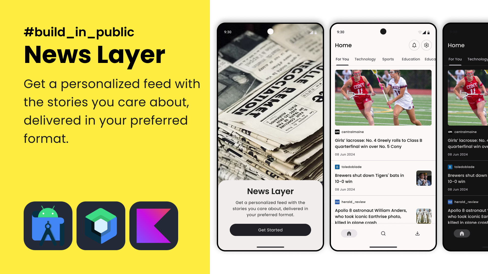

# NewsLayer
Get a personalized feed with the stories you care about


## Tech Stack
- Kotlin
- Jetpack Compose
- Retrofit
- Room
- Hilt, Dagger
- Navigation Compose
- Android Architecture Components


## Screenshots

### Onboarding Screen


[feature/onboarding](./feature/onboarding/src/main/java/org/dreamerslab/newslayer/feature/onboarding)

### HomeScreen


[feature/home](./feature/home/src/main/java/org/dreamerslab/newslayer/feature/home)

### SearchScreen


[feature/search](./feature/search/src/main/java/org/dreamerslab/newslayer/feature/search)

## Setup Project

NewsLayer uses a free news api [NewsData.io](https://newsdata.io) to fetch data. You need to
provide your own API key which you can create [here](https://newsdata.io/register).

Add your API key in `<root>/local.properties` file:

```
# ...

NEWS_DATA_API="YOUR_API_HERE"
```

Sync gradle files and run the project.
