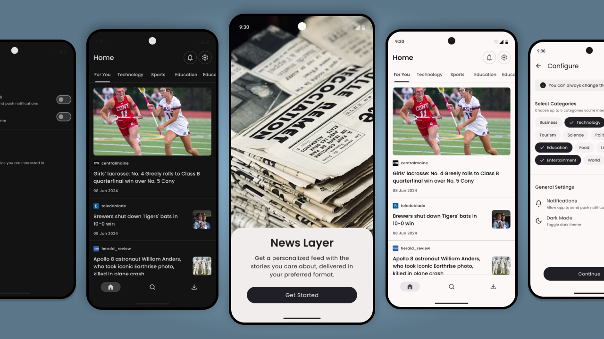
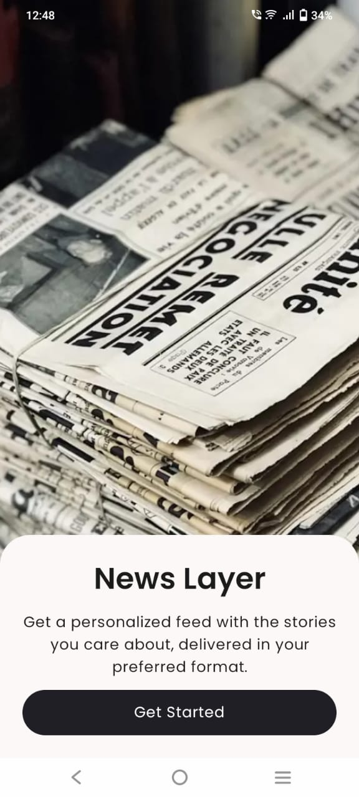
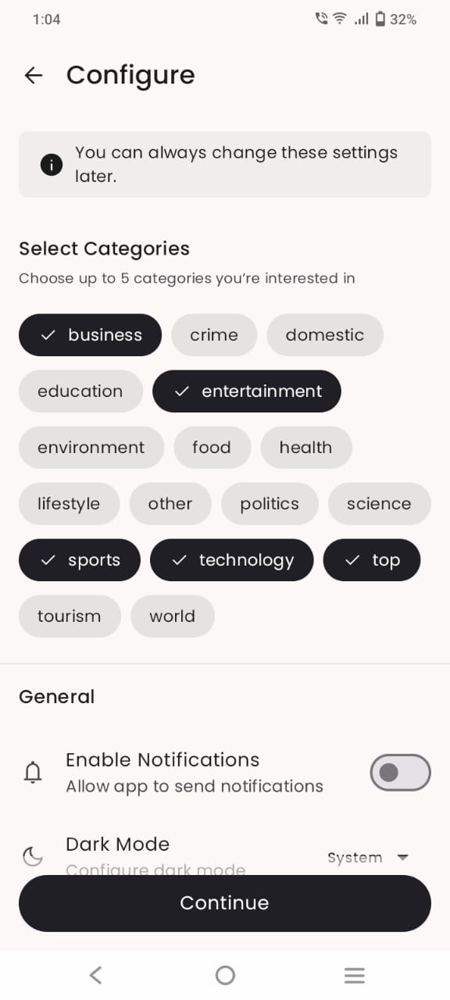
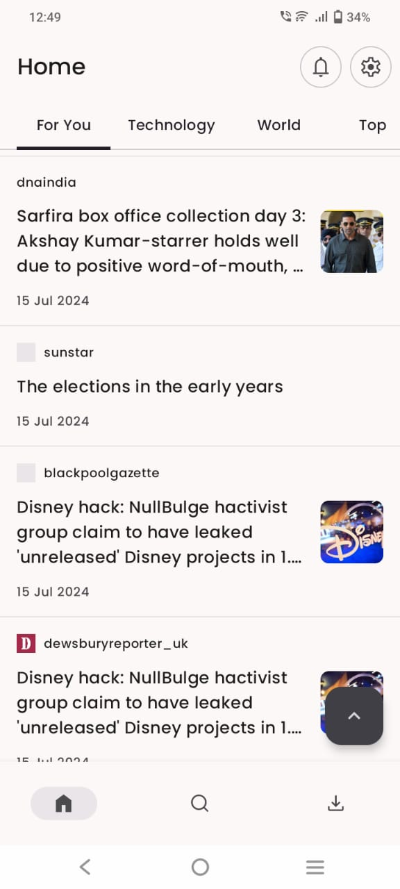

# NewsLayer

A modern Android news aggregation app built with Jetpack Compose, demonstrating clean architecture, reactive programming, and Material Design 3.

[](https://kotlinlang.org)
[](https://developer.android.com/jetpack/compose)
[](https://developer.android.com/topic/architecture)
[](LICENSE)

[Download APK](./app/release/app-release.apk) | [View Case Study](./CASE_STUDY.md)

---

## Features

- **Personalized Feed** - Select your favorite categories and get a curated news feed
- **Real-time Search** - Search articles with debounced queries and pagination
- **Article Details** - Read full articles with source information
- **Dark Mode** - System-aware theme switching with manual override
- **Smooth Onboarding** - Category selection and notification permission flow
- **Infinite Scroll** - Seamless pagination with Paging 3

## Screenshots

<table>
  <tr>
    <td></td>
    <td></td>
    <td></td>
    <td></td>
  </tr>
  <tr>
    <td align="center">Welcome</td>
    <td align="center">Categories</td>
    <td align="center">Home Feed</td>
    <td align="center">Search</td>
  </tr>
</table>

---

## Architecture

NewsLayer follows **Modern Android Architecture** with MVVM pattern and clean separation of concerns:

```
app/                    # Entry point, navigation, theme
├── feature/
│   ├── onboarding/     # Welcome & category selection
│   ├── home/           # News feed with filtering
│   ├── search/         # Search functionality
│   └── articledetails/ # Article detail view
├── core/
│   ├── data/           # Repository, API, network DI
│   ├── datastore/      # User preferences (DataStore + Protobuf)
│   └── model/          # Domain entities
├── common/
│   ├── ui/             # Reusable Compose components
│   └── resources/      # Shared strings & drawables
└── build-logic/        # Custom Gradle convention plugins
```

### Key Architectural Decisions

| Aspect | Implementation |
|--------|----------------|
| UI Layer | Jetpack Compose with Material 3 |
| State Management | StateFlow + ViewModel |
| Navigation | Compose Navigation with type-safe routes |
| Dependency Injection | Hilt |
| Networking | Retrofit + OkHttp |
| Data Persistence | DataStore with Protocol Buffers |
| Error Handling | Arrow Either for functional error handling |
| Pagination | Paging 3 |

---

## Tech Stack

### Core
| Technology | Version | Purpose |
|------------|---------|---------|
| Kotlin | 2.0.0 | Language |
| Jetpack Compose | BOM 2024.06.00 | Declarative UI |
| Material 3 | Latest | Design system |
| Hilt | 2.51.1 | Dependency injection |

### Data Layer
| Technology | Version | Purpose |
|------------|---------|---------|
| Retrofit | 2.11.0 | HTTP client |
| OkHttp | 4.12.0 | Network layer |
| Kotlinx Serialization | 1.7.0 | JSON parsing |
| DataStore | 1.1.1 | Preferences storage |
| Protocol Buffers | 4.26.0 | Typed preferences |
| Paging 3 | 3.3.0 | Pagination |

### Architecture Components
| Technology | Version | Purpose |
|------------|---------|---------|
| Lifecycle ViewModel | 2.8.3 | State management |
| Navigation Compose | 2.8.0-beta04 | Screen navigation |
| Arrow | 1.2.4 | Functional programming |
| Coil | 2.6.0 | Image loading |

### Code Quality
| Tool | Purpose |
|------|---------|
| Spotless + KtLint | Code formatting |
| Compose Compiler Metrics | Performance monitoring |
| Gradle Convention Plugins | Standardized module setup |

---

## Project Setup

### Prerequisites
- Android Studio Hedgehog (2023.1.1) or newer
- JDK 17+
- Android SDK 34

### API Key Configuration

NewsLayer uses [NewsData.io](https://newsdata.io) API. Get your free API key:

1. Register at [newsdata.io/register](https://newsdata.io/register)
2. Copy your API key
3. Add to `local.properties` in project root:

```properties
NEWS_DATA_API="your_api_key_here"
```

### Build & Run

```bash
# Clone the repository
git clone https://github.com/zainulhassan815/NewsLayer.git

# Navigate to project
cd NewsLayer

# Build debug APK
./gradlew assembleDebug

# Install on connected device
./gradlew installDebug
```

---

## Module Overview

| Module | Description |
|--------|-------------|
| `:app` | Main application module with navigation setup |
| `:feature:onboarding` | Welcome flow and category selection |
| `:feature:home` | News feed with category filtering |
| `:feature:search` | Article search with debouncing |
| `:feature:articledetails` | Full article view |
| `:core:data` | Repository pattern, API definitions, network DI |
| `:core:datastore` | User preferences with DataStore |
| `:core:model` | Domain models and entities |
| `:common:ui` | Reusable Compose components |
| `:common:resources` | Shared resources |

---

## Code Highlights

### Type-Safe Navigation
```kotlin
@Serializable
data class ArticleDetails(val articleId: String)

// Navigate with type safety
navController.navigate(ArticleDetails(article.id))
```

### Functional Error Handling
```kotlin
sealed interface NewsRepositoryFailure {
    data class HttpError(val code: Int, val message: String) : NewsRepositoryFailure
    data class NetworkError(val exception: IOException) : NewsRepositoryFailure
}

// Repository returns Either type
suspend fun getNews(): Either<NewsRepositoryFailure, NewsArticlesPage>
```

### Reactive State Management
```kotlin
val uiState: StateFlow<HomeState> = combine(
    newsFlow,
    userDataFlow
) { news, userData ->
    HomeState.Success(news, userData)
}.stateIn(viewModelScope, SharingStarted.WhileSubscribed(5_000L), HomeState.Loading)
```

---

## Roadmap

- [ ] Offline caching with Room
- [ ] Bookmark articles
- [ ] Push notifications
- [ ] Home screen widget
- [ ] Share articles
- [ ] Unit & UI tests

---

## Contributing

Contributions are welcome! Please feel free to submit a Pull Request.

---

## License

This project is available under the MIT License. See [LICENSE](LICENSE) for details.

---

## Contact

**Zain Ul Hassan**

[](https://github.com/zainulhassan815)
[](https://linkedin.com/in/zainulhassan815)

---

*Built with modern Android development practices*
